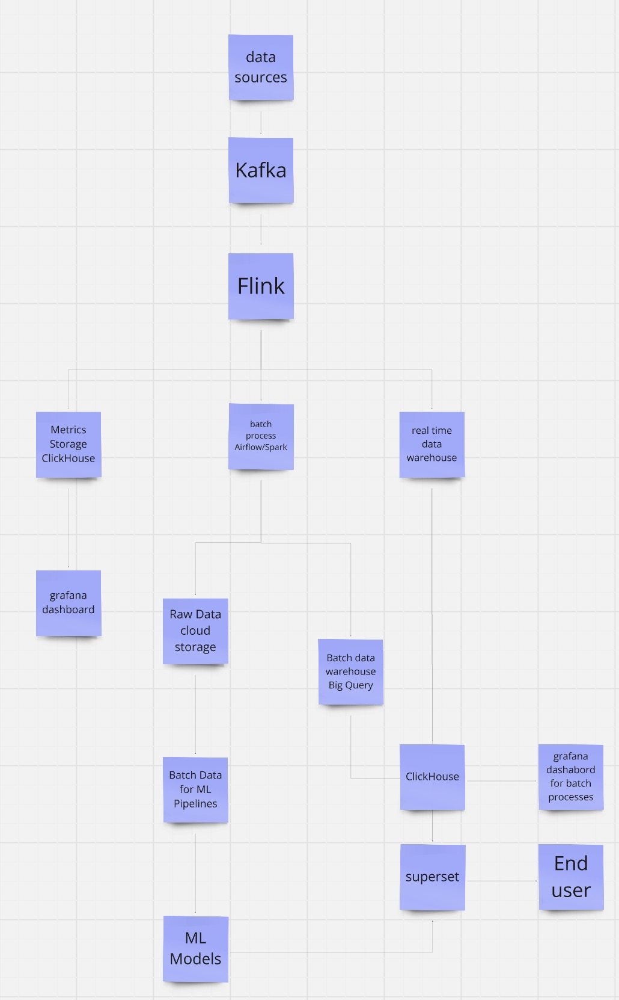

# **ETL Project: Soccer Data/Winner Predictions**

## Overview

This project is focused on building a robust and scalable ETL pipeline to process, analyze, and visualize soccer game data in real-time. It leverages batch and streaming data processing to deliver actionable insights to end users.

## Architecture

- **Data Flow**: Data is ingested from various APIs into Kafka, processed using Flink for real-time streaming analytics, and Spark for batch processing and transformations.
- **Orchestration**: Airflow is used to coordinate and manage the workflows seamlessly.
- **Data Storage**: Processed data is stored in AWS S3 for raw data and Google BigQuery as a batch data warehouse. Metrics are also stored in ClickHouse for real-time analysis.
- **Visualization**: Dashboards are created using Superset and Grafana to enable end users to interact with the data and gain valuable insights.

## Technologies Used

- **Languages**: Python
- **ETL Tools**: Kafka, Flink, Spark, Airflow
- **Storage**: AWS S3, BigQuery, ClickHouse
- **Visualization**: Superset, Grafana
- **Cloud Platform**: AWS

## Data Flow Diagram

## Future Plans

- Integrating AI-driven predictive models for game outcome forecasting.
- Developing a user-friendly frontend to enhance accessibility.

This project showcases modern data engineering and processing techniques to deliver meaningful and timely analytics to end users.
